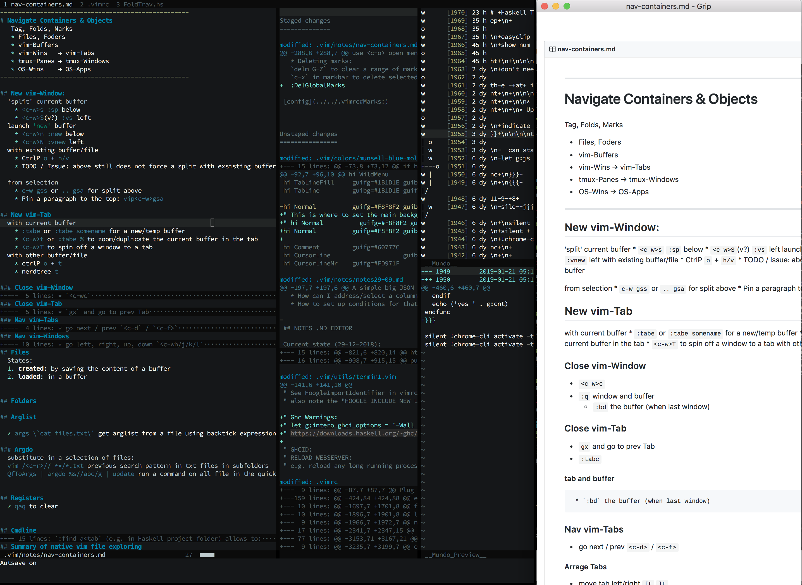
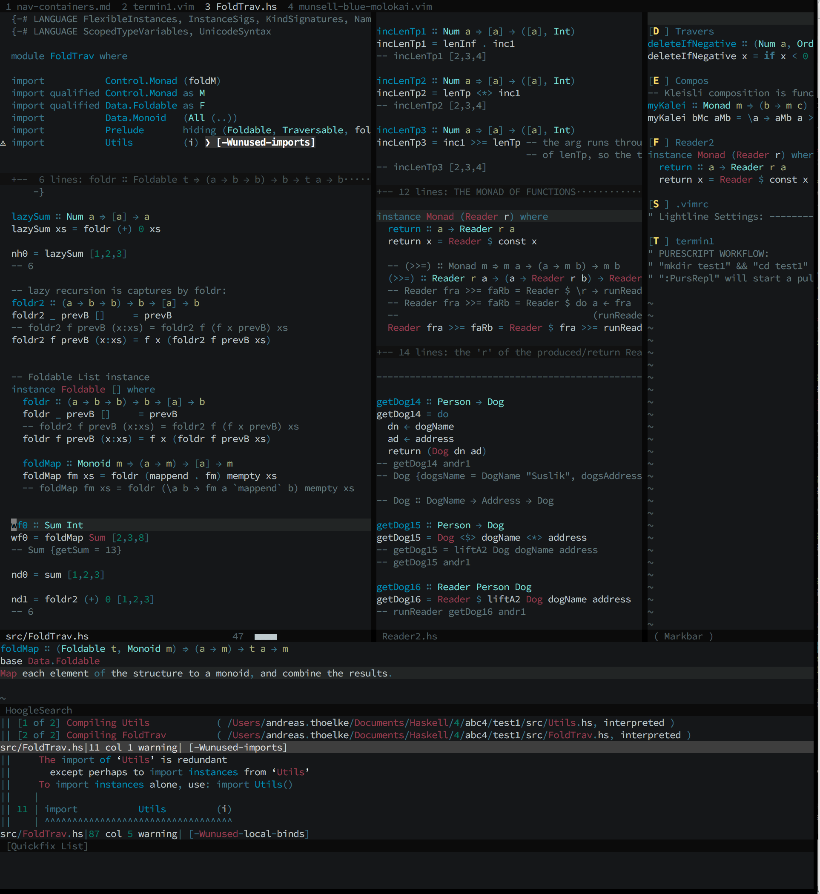

# dotfiles

Vim setup focused on
  * Markdown, Note writing
  * Haskell, Purescript development

## Markdown writing
  * `:Markdown` to launch Grip markdown preview in Chromium




## Haskell development

  * Custom colorscheme "Munsell-blue"
  * Haskell syntax highlighting in Markbar.vim





### Features

#### Run Repl/Ghci function calls in the code buffer (Haskell & Purescript):

Run `gei` ("go evaluate insert") on a (commented) expression (e.g. function call):

```
-- getDog14 andr17
```
The result of the evaluation is inserted below:
```
-- Dog {dogsName = DogName "Suslik", dogsAddress = Address "Berlin"}
```
See `ReplEvalExpr_Insert` in `.vimrc` and `PursEval` in `.vim/utils/termin1.vim`

#### Import Haskell identifiers using Hoogle and Hsimport:
1. Use `gsd` ("go search docs") on a missing identifier or run (e.g.) `:Hoogle replicateM`/ or `:Hoogle (Applicative m) ⇒ Int → m a → m [a]`
2. In the Hoogle list of available identifiers (see screenshot above), go to the line/indentifier you want to import and type `<leader>ii`. Confirm the identifier has been added to the import section of your source file.

See `HoogleImportIdentifier` in `.vimrc`

#### Syntax highlight and auto-expand/close the quickfix list
See `QuickfixRefeshStyle` in `.vimrc`


